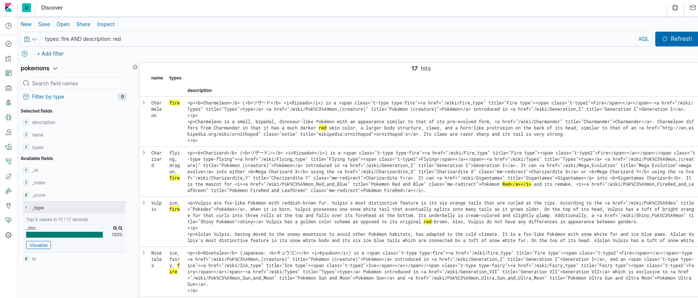

==========
PokElastic
==========

.. image:: https://img.shields.io/badge/python-3.8+-blue
   :target: https://www.python.org/downloads/release/python-380/
   :alt: Python3.8+ compatible

.. image:: https://img.shields.io/badge/License-MIT-green.svg
   :target: https://github.com/thomasperrot/aes-square-attack/blob/master/LICENSE.rst
   :alt: MIT License

A demonstration project to present Elasticsearch to EFM team in PeopleDoc.

.. raw:: html

    

Overview
========

This project is aimed at presenting Elasticsearch to EFM team in PeopleDoc. To
do this, it demonstrates how to create a simple search engine with scrapped
documents from `Pokémon Wiki`_. The harvested data can be analyzed using a
local Kibana_ instance. ElasticSearch and Kibana instance are run within
Docker_ thanks to `Docker Compose`_. We use the framework Scrapy_ in order to
ease the harvesting process.

.. _Pokémon Wiki: https://pokemon.fandom.com/
.. _Scrapy: https://scrapy.org/
.. _ElasticSearch: https://www.elastic.co/fr/
.. _Kibana: https://www.elastic.co/fr/kibana
.. _Docker: https://www.docker.com/
.. _Docker Compose: https://docs.docker.com/compose/

Quickstart
==========

To install it, simply run:

.. code-block:: bash

   pip install -r requirements.txt
   pip install .

Then start Elasticsearch and Kibana instance:

.. code-block:: bash

   docker-compose up -d

Finally, run the crawler using the following command:

.. code-block:: bash

   scrapy runspider pokelastic/spiders/pokemon_spider.py

Results
=======

After you have filled your Pokedex, you can go to http://localhost:5601 and
enjoy your wonderful Kibana search engine.

Issues
======

If you encounter an issue, please fill free to open an issue_.

.. _issue: https://github.com/thomasperrot/pokelastic/issues